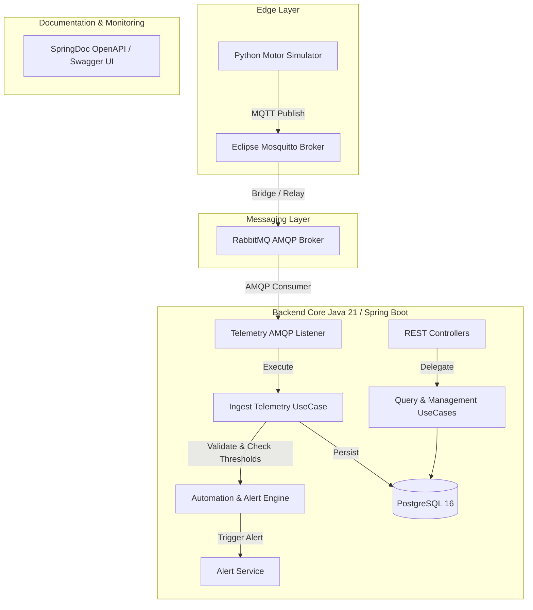

# 🏭 Industry IIoT - Motor Telemetry & Machinery Health Management

[](https://oracle.com/java/)
[](https://spring.io/projects/spring-boot)
[](https://www.postgresql.org/)
[](https://www.rabbitmq.com/)
[](https://mosquitto.org/)
[](https://www.docker.com/)

An Industry 4.0 IoT backend platform designed for real-time electric motor telemetry processing, anomaly detection, automated actuation rules, and machinery health management. Built with **Java 21**, **Spring Boot**, **Clean Architecture**, and an **Event-Driven Architecture (EDA)** messaging pipeline.

---

## 🎯 System Architecture & Design Principles

The backend is built following **Clean Architecture (Hexagonal Architecture)** and **SOLID Principles** to ensure strict separation of concerns, high maintainability, and testability.



### Key Architectural Highlights
- **Event-Driven Architecture (EDA):** Asynchronous telemetry processing via MQTT and RabbitMQ AMQP queues for minimal ingestion latency and maximum fault tolerance.
- **Java 21 Virtual Threads (Loom):** Enabled (`spring.threads.virtual.enabled=true`) for lightweight concurrent IO handling and high throughput.
- **Clean Controller & Use Case Pattern:** REST Controllers act as clean delegates to isolated business Use Cases without leaking persistence or framework details into domain logic.
- **Schema Management:** Relational persistence managed with PostgreSQL 16 and Flyway migrations.

---

## 🛠️ Technology Stack

| Domain | Technology | Description |
| :--- | :--- | :--- |
| **Language** | Java 21 | Modern LTS features (Virtual Threads, Pattern Matching, Records) |
| **Framework** | Spring Boot | WebMVC, Data JPA, AMQP, Validation, DevTools |
| **Database** | PostgreSQL 16 | Relational historical telemetry & asset management store |
| **Migrations** | Flyway | Versioned database migrations |
| **Messaging** | RabbitMQ 3 & Mosquitto | AMQP messaging broker with Management Console + MQTT |
| **API Spec** | OpenAPI 3.0 / Swagger | Automated documentation via `springdoc-openapi` |
| **Containers** | Docker & Docker Compose | Containerized local infrastructure environment |
| **Build Tool** | Apache Maven | Project build and dependency management |

---

## 🗄️ Database Schema & Domain Model

The relational database is structured into 8 domain tables supporting multi-tenant plant management, sensor telemetries, threshold monitoring, and maintenance work orders.

```
+------------------+        +------------------+        +------------------+
|     sectors      | 1    * |    equipments    | 1    * |     sensors      |
+------------------+<-------+------------------+<-------+------------------+
| id (PK)          |        | id (PK)          |        | id (PK)          |
| name             |        | code (Tag)       |        | equipment_id (FK)|
| description      |        | type (MOTOR,...) |        | code             |
+------------------+        | status           |        | type             |
                            | sector_id (FK)   |        | mqtt_topic       |
                            +------------------+        | min/max_threshold|
                                     ^                  +------------------+
                                     |                           | 1
                                     | 1                         |
                                     |                           v *
+------------------+        +------------------+        +------------------+
|   work_orders    |        |      alerts      |        |  telemetry_data  |
+------------------+        +------------------+        +------------------+
| id (PK)          |        | id (PK)          |        | id (PK)          |
| alert_id (FK)    |        | sensor_id (FK)   |        | sensor_id (FK)   |
| equipment_id (FK)|<-------| severity         |        | timestamp        |
| assigned_to (FK) |        | value_at_trigger |        | value            |
| status           |        | status           |        | raw_payload      |
+------------------+        +------------------+        +------------------+
```

### Domain Entities:
- **`sectors`**: Industrial sectors (e.g., *Pátio Fabril, Linha A, HVAC*).
- **`users`**: Platform users with roles (`OPERATOR`, `TECHNICIAN`, `MANAGER`, `ADMIN`).
- **`equipments`**: Industrial assets tagged with code (e.g., `MOT-101`, `HVAC-02`).
- **`sensors`**: Physical sensors attached to assets (`VOLTAGE`, `CURRENT`, `TEMPERATURE`, `VIBRATION`).
- **`telemetry_data`**: High-frequency time-series measurements and raw JSON payloads.
- **`alerts`**: System alerts (`INFO`, `WARNING`, `CRITICAL`) generated on threshold breaches.
- **`work_orders`**: Maintenance tasks created manually or automatically from critical alerts.
- **`automation_rules`**: Configurable rules for automated actuation loops (e.g., turning exhauster ON when temperature exceeds threshold).

---

## ⚡ Getting Started

### Prerequisites
Make sure you have the following installed on your host machine:
- **Java 21 JDK**
- **Docker & Docker Compose**
- **Maven** (or use the provided `./mvnw` wrapper)

### 1. Launch Infrastructure Containers
From the root project folder containing `docker-compose.yml`, run:

```bash
docker-compose up -d
```

This starts:
- **PostgreSQL 16**: Port `5432` (`machinery_db`)
- **RabbitMQ Management**: Port `5672` (AMQP) & `15672` (Web UI - `iiot`/`iiot`)
- **Mosquitto MQTT Broker**: Port `1883` (MQTT) & `9001` (WebSockets)

### 2. Run the Spring Boot Application
Navigate to `backend/industry_iiot` and start the server:

```bash
./mvnw spring-boot:run
```

Or run via Java CLI:

```bash
./mvnw clean package -DskipTests
java -jar target/iiot-0.0.1-SNAPSHOT.jar
```

The application will start on **`http://localhost:8080`**.

---

## 📚 API Documentation & Interactive UI

Interactive OpenAPI 3.0 documentation is generated automatically at startup.

- **Swagger UI**: [http://localhost:8080/swagger-ui.html](http://localhost:8080/swagger-ui.html)
- **OpenAPI JSON Docs**: [http://localhost:8080/v3/api-docs](http://localhost:8080/v3/api-docs)

---

## 🛰️ Telemetry Simulation (Python Publisher)

To send real-time simulated motor telemetries (3-phase voltage, current, temperature, and vibration RMS ISO 20816) into the MQTT broker:

```bash
cd simulators
python3 -m venv venv
source venv/bin/activate
pip install -r requirements.txt
python main.py
```

Sample telemetry payload:
```json
{
  "equipment_code": "MOT-101",
  "voltage": 381.45,
  "current": 8.20,
  "temperature": 72.30,
  "vibration": 2.15,
  "timestamp": 1722096000
}
```

---

## 🧪 Testing & Code Quality

Run unit and integration tests with Maven:

```bash
./mvnw test
```

---

## 🗺️ Project Roadmap & Milestones

- [x] **Milestone 1:** Docker Infrastructure (PostgreSQL + RabbitMQ + Mosquitto) & Python Simulator.
- [ ] **Milestone 2:** Domain Modeling, Relational Schema (DBML), Clean Architecture & AMQP Consumers.
- [ ] **Milestone 3:** Angular Dashboard Integration, WebSockets / SSE for Real-Time Monitoring.
- [ ] **Milestone 4:** Feedback Loop & Actuation Rules (Python Actuator integration).
- [ ] **Milestone 5:** HVAC Thermal Control & Energy Efficiency Rules.
- [ ] **Milestone 6:** Spring Security (JWT Authentication) & Enterprise Production Deployment.

---

## 📄 License

Distributed under the MIT License. See `LICENSE` for more information.
